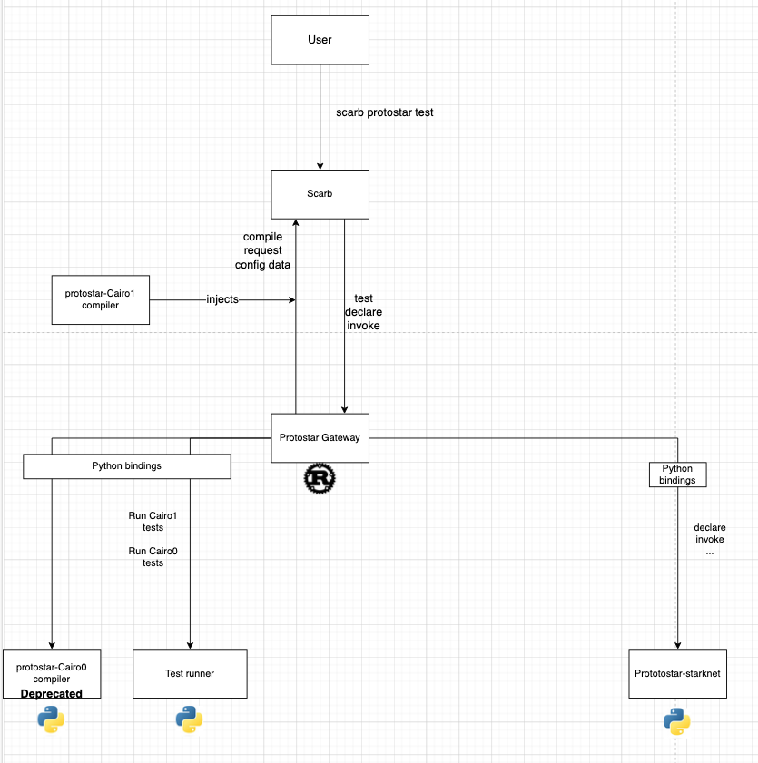

# Protostar modular architecture

This document proposes the idea how to modularize Protostar. Goals of the modularization are
- Allow to introduce better ownerships of the codebase parts
- Make workflow asynchronous between smaller sub-teams operating on contracts between modules
- Allow incremental rewrite to Rust
- Remove compilation responsibility from Protostar codebase


## General overview
First decomposition of Protostar will introduce 3 modules

- Protostar Gateway
- Protostar Starknet
- Protostar Testing backend

Each of the modules would be a separate poetry package (open question?), to simplify scenarios of updating different dependencies. Example of such scenario, Protostar-starknet relies on starknet.py and devnet but testing backend does not. As a final goal everything would be under one cargo workspace.


## Modules
### Protostar Gateway
This module will be a communication layer of Protostar with outer world, namely Scarb. Its responsibility will be to provide Scarb with a correct cairo compiler (or dependencies in the future) and to fetch configuration from Scarb config. This module will be routing commands as requests to other services. Output formatting will be responsibility of the Gateway


### Testing backend
This module will be responsible for resolving a transaction
```
Input: List of test suites and their code, testing backend config
Output: Stream of test results + summary as a final element
```

Anything outside of this transaction will be encapsulated in the backend.


### Starknet CLI
This is a facade over starknet.py SDK, we can migrate it to Rust very soon and use Starknet.rs instead if its capabilities are sufficient.


## Communication
Communication layer between modules will be JSON, simillar to the current Protostar `--json` to make it language-independent. We can do communication either through FFI or calling as sub-processes, this is an open question.

## Benefits
- Modularity of backends based on contracts allows us to provide interchangeable backends for different purposes. For example we can support both sierra and casm backends simultaneously. Or we can support different Protostar-starknets, in python and rust depending on which sdk will update faster to new changes or at least maintain the python solution while rust version is being developed.
- Smaller teams focused on smaller goals, It would support asynchronous work.

## Threats
- Mixing technologies and using bindings will introduce additional overhead, hopefully we will be able to remove it completely at some point.

## Testing
Each module will be tested separately based on the cross-module contracts.
Additionally we will introduce e2e tests set involving scarb layer testing some basing flows.  

## Open questions
- Communication flow between modules - subprocesses or FFI
- Should we have a separate poetry package for each module?


## Actionable steps
Split Protostar into three python-based modules and introduce the JSON based communication into the current codebase.
Simultaneously we will kick-off rust based Protostar Gateway module which will work with Scarb and in the future will replace the original, python Gateway.

   